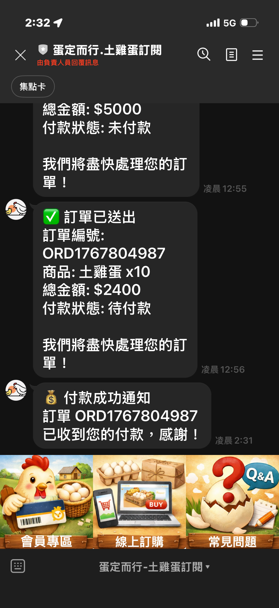
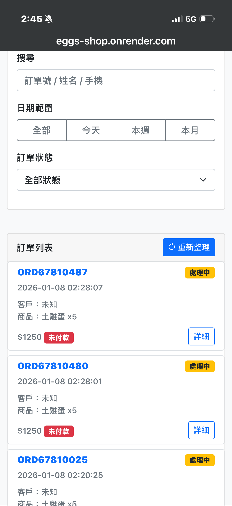
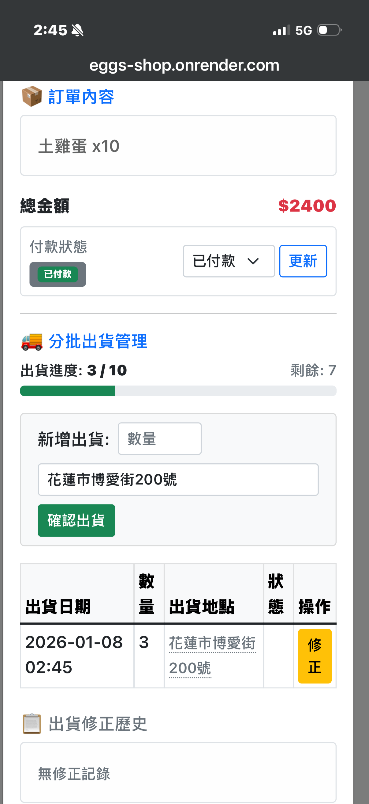
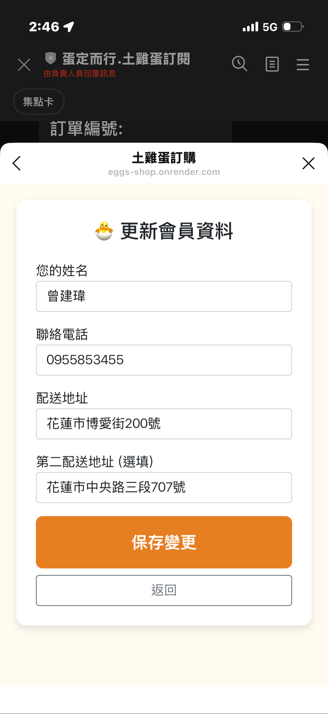

# 🐔 土雞蛋訂購與管理系統 (LINE LIFF + Flask + Google Sheets + ECPay)
介紹影片：https://www.youtube.com/watch?v=t_SznU7OYNU
這是一個專為農產品銷售設計的完整解決方案，結合了 LINE LIFF 的便捷性、Python Flask 的強大後端邏輯、Google Sheets 作為輕量級資料庫的靈活性，以及 **綠界 (ECPay) 金流服務**。系統包含**客戶端訂購介面**與**管理員專屬後台**，支援分批出貨管理、自動化 LINE 通知與線上金流整合。

## 系統畫面
### 土雞蛋LINE官方號

### 管理後台

### 訂單列表

### 出貨紀錄

### 會員資料管理


## ✨ 核心功能

### 📱 客戶端 (LINE LIFF)
*   **會員註冊**：
    *   自動綁定 LINE 帳號。
    *   填寫姓名、電話、出生日期。
    *   支援 **雙配送地址** 設定。
*   **會員自服務更新**：
    *   已註冊會員點選「新增會員」連結時，系統自動識別並顯示編輯表單。
    *   編輯表單預先載入舊資料，使用者可直接修改。
    *   編輯完成後儲存並返回歡迎頁面。
*   **商品訂購與支付**：
    *   直觀的商品選擇與數量調整。
    *   **土雞蛋1盤優惠方案**：訂購「土雞蛋1盤」時，單價會依數量變動 (1-9盤: $250/盤, 10-19盤: $240/盤, 20盤以上: $230/盤)。
    *   **優惠組自動轉換**：選擇「11盤優惠組」，系統自動記錄為 11 盤。
    *   **多元付款方式**：
        *   **銀行轉帳/貨到付款**：傳統線下支付模式。
        *   **線上支付 (綠界)**：支援信用卡、ATM 虛擬帳號、LINE Pay 等（目前為測試環境）。
*   **訂購紀錄查詢**：
    *   即時查看歷史訂單狀態。
    *   顯示詳細資訊：日期、商品內容、金額。
    *   **付款資訊**：清楚顯示付款狀態（如「已付款」）與付款方式（如「線上支付 (綠界)」）。
*   **即時通知**：
    *   下單成功後，自動收到 LINE 確認訊息。
    *   **付款成功通知**：線上支付完成後，即時推播確認訊息。
    *   出貨或狀態變更時，自動收到進度通知。
    *   **出貨地點通知**：每次出貨會記錄配送地點並在通知中顯示。

### 💻 管理員後台 (/admin)
*   **安全登入**：
    *   **多帳號管理**：支援多個管理員帳號，在環境變數中設定。
    *   **會話超時保護**：無操作 180 秒自動登出，防止無人工作台洩露。
*   **訂單總覽**：
    *   支援依日期、訂單狀態篩選，以及關鍵字搜尋。
    *   直觀的狀態標籤 (物流狀態 + 付款狀態)。
    *   **新增「付款方式」欄位**：快速辨識訂單是透過轉帳還是綠界支付。
    *   **回應式設計 (RWD)**：支援桌機表格檢視和手機卡片式檢視。
*   **會員資料管理**：
    *   查看會員詳細資訊（姓名、電話、地址）。
    *   直接編輯並更新會員資料。
*   **分批出貨管理 (Partial Delivery)**：
    *   支援單筆訂單分多次出貨，視覺化顯示出貨進度。
    *   **出貨地點記錄**：每次出貨可指定或預設配送地點。
    *   **自動狀態更新**：當已配送數量 = 訂購數量時，自動標記訂單為「已完成」。
    *   **出貨修正功能**：可修正已記錄的出貨數量和配送地點。
*   **審計追蹤 (Audit Trail)**：
    *   完整記錄所有出貨修正操作（修正者、時間、修改內容）。
    *   查看修改前後的數值對比。
*   **金流管理**：
    *   **自動對帳**：綠界線上支付成功後，系統自動更新付款狀態為「已付款」。
    *   手動管理：亦可手動標記付款狀態，與物流狀態解耦。

## 🛠️ 技術架構

*   **前端**: HTML5, CSS (Bootstrap 5), JavaScript, LINE LIFF SDK
*   **後端**: Python 3.x, Flask
*   **資料庫**: Google Sheets (透過 gspread API)
*   **通訊**: LINE Messaging API (Push Message)
*   **金流**: ECPay SDK (綠界科技全方位金流)
*   **部署**: 支援 Render, Heroku 等雲端平台

## 🚀 快速開始

### 1. 環境設定
建立 `.env` 檔案以存放敏感資訊：
```env
# 應用程式基礎網址 (務必設定公開網址，供綠界回傳使用)
APP_BASE_URL=https://您的網址.onrender.com

# LINE Messaging API 設定
LINE_CHANNEL_ACCESS_TOKEN=你的_CHANNEL_ACCESS_TOKEN

# Google Sheets 設定
SPREADSHEET_ID=你的試算表ID

# 系統安全設定
FLASK_SECRET_KEY=請設定一個隨機亂碼

# 管理員帳號設定（格式：帳號:密碼,帳號:密碼）
ADMIN_ACCOUNTS=admin:admin123,manager:manager456

# 綠界金流設定 (預設為測試環境值)
ECPAY_MERCHANT_ID=2000132
ECPAY_HASH_KEY=5294y06JbISpM5x9
ECPAY_HASH_IV=v77hoKGq4kWxNNIS

# 時區設定（預設：亞洲/台北）
TIMEZONE=Asia/Taipei
```

### 2. Google Sheets 結構
請在試算表中建立以下工作表，並設定首列標題：

**`Members` 工作表**
| A | B | C | D | E | F |
| :--- | :--- | :--- | :--- | :--- | :--- |
| UserId | Name | Phone | Address | BirthDate | Address2 |

**`Orders` 工作表**
| A | B | C | D | E | F | G | H | I |
| :--- | :--- | :--- | :--- | :--- | :--- | :--- | :--- | :--- |
| OrderId | UserId | Item | Amount | Date | Status | DeliveryLogs | PaymentStatus | PaymentMethod |

**`DeliveryAuditLog` 工作表** *(新增，用於審計追蹤)*
| A | B | C | D | E | F | G | H |
| :--- | :--- | :--- | :--- | :--- | :--- | :--- | :--- |
| 時間戳記 | 訂單編號 | 操作類型 | 管理者帳號 | 修改前數值 | 修改後數值 | 原因 | 備註 |

*(注意：`DeliveryAuditLog` 工作表需要手動建立)*

### 3. 安裝依賴
```bash
pip install -r requirements.txt
```

### 4. 啟動服務
**本地開發 (使用 ngrok)**:
要啟動本地開發環境，您需要運行兩個獨立的指令：

1.  **啟動 Flask 應用程式**：
    ```bash
    python3 app.py
    ```
    此指令會啟動後端服務，通常在 `http://localhost:5005` 運行。

2.  **啟動 ngrok 以取得公開網址**：
    ```bash
    ngrok http 5005
    ```
    執行此指令後，`ngrok` 會提供一個公開的 URL (例如 `https://xxxx.ngrok-free.dev`)。請將此 URL 複製下來，並在 `.env` 檔案中設定 `APP_BASE_URL` 為此 ngrok 網址，或在啟動 Flask App 前以環境變數形式傳入。
    
    例如 (在新的終端機中運行 Flask App，並替換為您的 ngrok 網址):
    ```bash
    APP_BASE_URL=https://xxxx.ngrok-free.dev python3 app.py
    ```
*   前台入口：使用 ngrok 網址 (https://xxxx.ngrok-free.dev)
*   後台入口：https://xxxx.ngrok-free.dev/admin

## 📦 部署指南 (Render)

1.  將程式碼推送到 GitHub。
2.  在 Render 建立 Web Service。
3.  **Environment Variables**：將 `.env` 中的所有內容設定到 Render 的環境變數中，特別是 `APP_BASE_URL` 需設為 Render 提供的網址。
4.  **Secret Files**：上傳 `service_account.json`。
5.  **Build Command**: `pip install -r requirements.txt`
6.  **Start Command**: `gunicorn app:app`

## 📝 版本紀錄

*   **v3.1 (最新) - 2026/01/07**
    *   **會員自服務功能**：已註冊會員可自行編輯資料，編輯表單預先載入舊資料。
    *   **出貨地點追蹤**：每次出貨記錄配送地點，支援修正。
    *   **審計追蹤系統**：記錄所有出貨修正操作（修正者、時間、前後對比）。
    *   **會話超時保護**：無操作 180 秒自動登出，提升後台安全性。
    *   **多帳號管理**：支援在環境變數中設定多個管理員帳號。
    *   **數據完整性修復**：修復電話號碼存儲丟失前導零問題。
    *   **自動狀態更新修復**：完全配送訂單現在正確自動標記為已完成。
    *   **回應式設計**：管理後台支援桌機和手機檢視。
*   **v3.0**
    *   **整合綠界金流 (ECPay)**：支援信用卡、ATM、LINE Pay。
    *   **自動化對帳**：實作 Server-to-Server Callback，付款成功自動更新狀態。
    *   **資料庫擴充**：新增付款方式記錄欄位。
    *   介面優化：前台與後台同步顯示詳細付款資訊。
*   **v2.0**
    *   新增管理員登入驗證、分批出貨管理、付款狀態欄位。
*   **v1.0**
    *   基本訂購、註冊、歷史紀錄功能。

---

## ⚠️ 已知限制與注意事項

*   **Google Sheets API 配額**：免費帳號每日請求數有限，大量操作可能觸發限制。
*   **電話號碼格式**：建議統一使用 10 位台灣手機格式（09XXXXXXXX）。
*   **時區設定**：系統預設為台灣時區（Asia/Taipei），如需修改請在 `.env` 中調整。
*   **電話號碼存儲**：系統自動以文本格式存儲，前導零不會遺失。

## 🔄 常見問題

### Q：如何在 Render 上新增/修改管理員帳號？
A：在 Render Dashboard → Settings → Environment 中編輯 `ADMIN_ACCOUNTS` 環境變數：
```
admin:admin123,manager:manager456,owner:owner789
```
修改後自動重新部署。

### Q：為什麼會員編輯資料後看不到變更？
A：確認已按「保存變更」按鈕，並檢查 Google Sheets 是否已更新。若問題持續，嘗試重新整理頁面。

### Q：出貨記錄如何修正？
A：在管理後台訂單詳情中，點擊「修正」按鈕，可修改出貨盤數和配送地點。系統會自動記錄修正操作並更新審計日誌。

### Q：為什麼訂單狀態未自動更新為「已完成」？
A：確認已出貨的總數 ≥ 訂購數量，且系統已重新啟動（必要時）。檢查出貨紀錄中的數字是否正確輸入。

---
由 Gemini Agent 協助開發